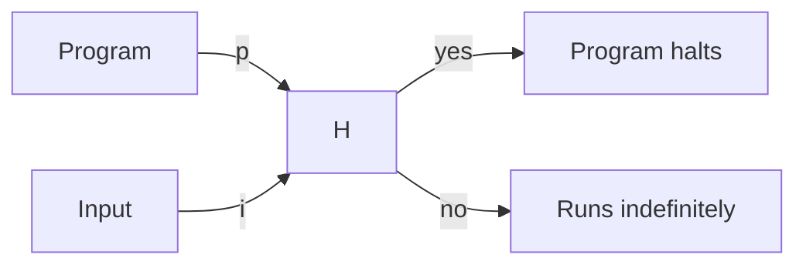

# Undecidability

As a matter of fact, there are some problems that are not solvable.
An elegant proof of this was devised by Alan Turing in 1936.

The Halting Problem demonstrates that **no machine** can decide whether an arbitrary computer program will finish running (halt) or continue to run indefinitely, for all possible inputs.

Turing's proof uses a technique called diagonalization, showing that if such an algorithm existed, it could be used to construct a program that contradicts its own output, leading to a paradox.
This result has profound implications in theoretical computer science, establishing limits on what can be computed.

## The Halting Problem

Let's start by assuming we have some machine `H` that can solve the halting problem.
This machine takes two inputs: a program `p` and an input `i`, and returns `true` if `p` halts on `i`, and `false` otherwise.

Now let's extend this machine to a new machine `H+` which again takes two inputs: a program `p` and an input `i`, but this time `H+` uses `H` to decide whether `p` halts on `p` itself.

If it does, then `H+` runs an infinite loop, otherwise it halts.
